# **Laporan Praktikum - #03 Components, JSX, dan Props**

|  | Pemrograman Berbasis Framework 2024 |
|--|--|
| NIM |  2141720063|
| Nama |  Maria Fadilla |
| Kelas | TI - 3A |


## **Praktikum 1: Mendefinisikan Komponen**
---
**Membuat Project Baru**


**Membuat Komponen Baru**

Membuat folder baru dan file baru di src/components/profile.tsx

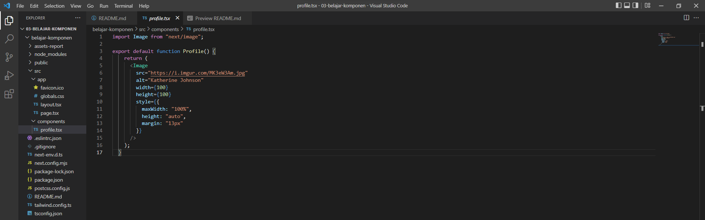

Mengimport komponen

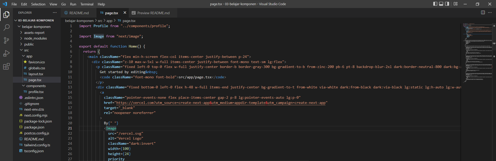

### **Jawaban Soal 1**

Mengubah isi kode Home() dengan memanfaatkan komponen Profile() yang tadi sudah dibuat dari langkah 1.

```bash
import Profile from "../components/profile";

export default function Home() {
  return (
    <main className="flex min-h-screen flex-col items-center justify-between p-24">
      <div className="z-10 max-w-5xl w-full items-center justify-between font-mono text-sm lg:flex">
        <p className="fixed left-0 top-0 flex w-full justify-center border-b border-gray-300 bg-gradient-to-b from-zinc-200 pb-6 pt-8 backdrop-blur-2xl dark:border-neutral-800 dark:bg-zinc-800/30 dark:from-inherit lg:static lg:w-auto  lg:rounded-xl lg:border lg:bg-gray-200 lg:p-4 lg:dark:bg-zinc-800/30">
          Ilmuwan yang luar biasa&nbsp;
        </p> 
        <div className="fixed top-0 left-0 flex h-48 w-full items-end justify-center bg-gradient-to-t from-white via-white dark:from-black dark:via-black lg:static lg:h-auto lg:w-auto lg:bg-none">
          <Profile />
          <Profile />
          <Profile />
        </div>
      </div>
    </main>
  );
}
```

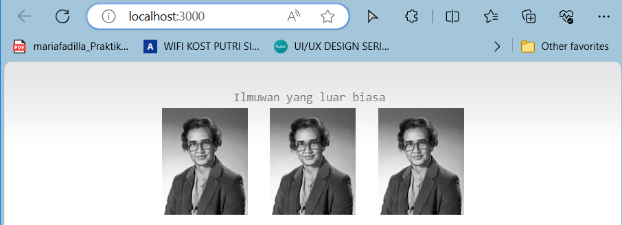

- Dalam bagian ini, saya mempelajari cara mendefinisikan komponon dan cara saya memperbaiki erorr dengan cara menambahkan code di file next.config.js.

## **Praktikum 02: Mengimpor dan Mengekspor Komponen**
---

**Membuat Komponen Baru**

```bash
import Profile from "./profile";

export function Gallery() {
    return (
        <div className="columns-3">
            <Profile />
            <Profile />
            <Profile />
        </div>
    );
}
```

**Impor Komponen**

Melakukan impor komponen di src/app/page.tsx.

```bash
import { Gallery } from "@/components/gallery";

...
```

### **Jawaban Soal 2**

Bagaimana tampilannya saat ini?

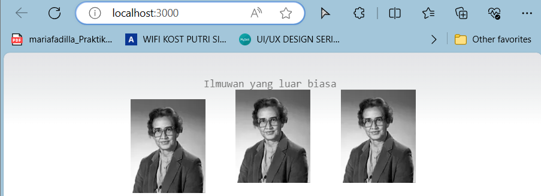

Saat ini tampilannya terlihat lebih berantakan daripada sebelumnya.

- import { Gallery } from "@/components/gallery"; merupakan pernyataan import yang mengimpor komponen Gallery dari lokasi relatif "@/components/gallery".
- JSX dan React berbeda, dapat digunakan bersama, namun dapat pula menggunakannya sendiri-sendiri. JSX merupakan ekstensi sintaks, sedangkan React adalah library JavaScript.
- JSX mirip dengan HTML, tapi sebenarnya diubah menjadi objek JavaScript. Ketika mengembalikan dua objek dari sebuah fungsi, perlu dibungkus ke dalam sebuah array. Begitu juga dengan JSX, dua tag perlu dibungkus ke dalam sebuah fragment.

### **Jawaban Soal 3**

Silahkan perbaiki kode JSX berikut ini. Anda boleh menggunakan konverter atau perbaiki secara manual.

```bash
    export default function Bio() {
        return(
            <div class="intro">
                <h1>Selamat Datang di website MARIA!</h1>
            </div>
            <p class="summary">
                Anda dapat membaca uneg-uneg saya di sini.
                <br><br>
                <b>Juga ada <i>foto</b></i> ilmuwan!
            </p>
        );
    }
```

Perbaikan kode nya adalah sebagai berikut:

```bash
import { Gallery } from "@/components/gallery";

export default function Bio() {
  return (
      <div className="intro">
          <h1>Selamat Datang di website MARIA!</h1>
          <p className="summary">
              Anda dapat membaca uneg-uneg saya di sini.
              <br /><br />
              <b>Juga ada <i>foto</i> ilmuwan!</b>
              <Gallery />
          </p>
      </div>
  );
}
```

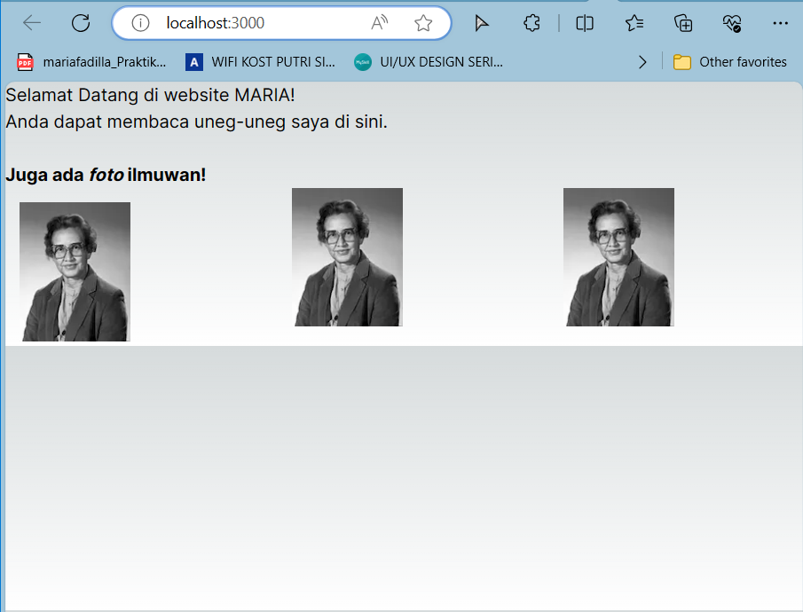

Error yang terjadi karena kesalahan dalam struktur JSX pada fungsi Bio().

Perbaikan yang dilakukan:
- Mengganti class menjadi className karena di JSX, kita menggunakan className untuk menentukan kelas CSS.
- Memindahkan tag `<p>` ke dalam `<div>` agar menjadi satu kesatuan.
- Menutup tag `<br />` dengan tanda slash.
- Menghapus tag `<b>` yang kurang ditutup dengan benar.
- Menghapus tag `<i>` yang salah penutupannya.
- Memperbaiki penutupan tag `<i>` yang seharusnya di dalam tag `<b>`.

## **Praktikum 03: Menggunakan JSX Dinamis**
---

**Membuat Komponen Baru**

Membuat file baru di src/components/todolist.tsx. 

```bash
const person = {
  name: 'Gregorio Y. Zara',
  theme: {
    backgroundColor: 'black',
    color: 'pink'
  }
};

export default function TodoList() {
  return (
    <div style={person.theme}>
      <h1>{person}'s Todos</h1>
      
      <ul>
        <li>Improve the videophone</li>
        <li>Prepare aeronautics lectures</li>
        <li>Work on the alcohol-fuelled engine</li>
      </ul>
    </div>
  );
}
```

### **Jawaban Soal 4**

Memperbaiki kode menjadi:

```bash
const person = {
    name: 'Gregorio Y. Zara',
    theme: {
      backgroundColor: 'black',
      color: 'pink'
    }
  };
  
  export default function TodoList() {
    return (
      <div style={person.theme}>
        <h1>{person.name}&apos;s Todos</h1>
        
        <ul>
          <li>Improve the videophone</li>
          <li>Prepare aeronautics lectures</li>
          <li>Work on the alcohol-fuelled engine</li>
        </ul>
      </div>
    );
  }
```

**Impor Komponen**

Melakukan impor komponen di src/app/page.tsx seperti berikut ini.

```bash
import { Gallery } from "@/components/gallery";
import TodoList from "@/components/todolist";

export default function Home() {
    return (
        <section>
            <h1 className="font-semibold text-slate-900 truncate pr-20 text-center">Ilmuwan yang luar biasa</h1>
            <hr />
            <Gallery />
            <hr />
            <TodoList />
        </section>
    );
}
```

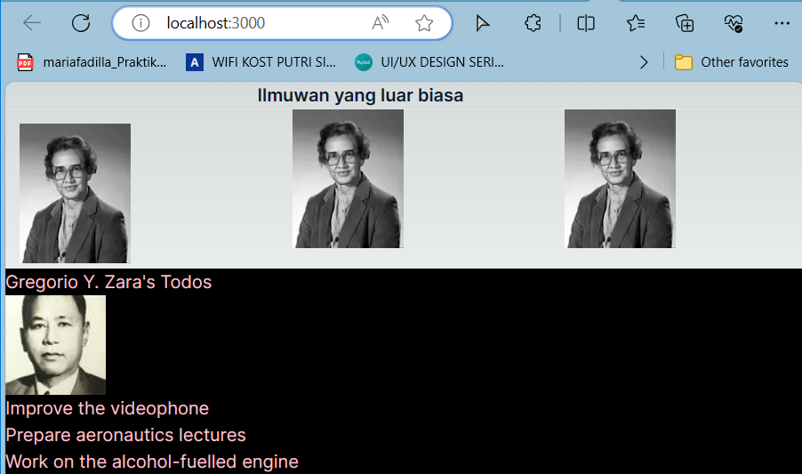

### **Jawaban Soal 5**

Membuka file src/components/todolist.tsx dan melakukan ekstrak URL gambar ke dalam objek person.

```bash
const person = {
  name: 'Gregorio Y. Zara',
  theme: {
    backgroundColor: 'black',
    color: 'pink'
  },
  imageUrl: 'https://i.imgur.com/7vQD0fPs.jpg' // Ekstrak URL gambar ke dalam objek person
};

export default function TodoList() {
    return (
        <div style={person.theme}>
            <h1>{person.name}&apos;s Todos</h1>
            
        <ul>
            <li>Improve the videophone</li>
            <li>Prepare aeronautics lectures</li>
            <li>Work on the alcohol-fuelled engine</li>
        </ul>
        </div>
    );
}
```

Hasil tampilannya adalah sebagai berikut:


Apakah ada perbedaan pada tampilan web saat ini?

- Pada tampilan web saat ini, jika dibandingkan dengan sebelum dilakukan ekstrak URL gambar ke dalam objek person, maka tampilannya adalah sama. Namun, jika dibandingkan dengan tampilan web pada soal 2, maka tampilannya sudah berbeda. Typing judulnya berbeda dan secara tata letak jarak antara judul dengan gambar sudah lebih rapi. Perbedaan utamanya terletak pada struktur markup HTML dan penggunaan kelas CSS. Yang pertama lebih kompleks dalam hal struktur HTML dan penggunaan kelas CSS yang diterapkan langsung ke elemen, sedangkan yang kedua lebih sederhana dengan hanya menggunakan elemen HTML tanpa kelas CSS yang diterapkan secara langsung.
- Pada tampilan web saat ini juga, yang ditampilkan ialah dua komponen, `Gallery` dan `ToDoList`.

**Ubah Ekspresi URL di src**

Pada file src/components/todolist.tsx ubahlah objek person dan tambah variabel baseUrl. URL lengkap gambar dibagi menjadi empat bagian: URL dasar, imageId, imageSize, dan ekstensi file.

Kita ingin URL gambar menggabungkan atribut-atribut ini bersama-sama: URL dasar (selalu 'https://i.imgur.com/'), imageId ('7vQD0fP'), imageSize ('s'), dan ekstensi file (selalu '.jpg'). Namun, ada yang salah dengan atribut src.

Bisakah anda memperbaikinya?

```bash
const baseUrl = 'https://i.imgur.com/';
const person = {
  name: 'Gregorio Y. Zara',
  imageId: '7vQD0fP',
  imageSize: 's',
  theme: {
    backgroundColor: 'black',
    color: 'pink'
  }
};

export default function TodoList() {
  return (
    <div style={person.theme}>
      <h1>{person.name}'s Todos</h1>
      
      <ul>
        <li>Improve the videophone</li>
        <li>Prepare aeronautics lectures</li>
        <li>Work on the alcohol-fuelled engine</li>
      </ul>
    </div>
  );
}
```

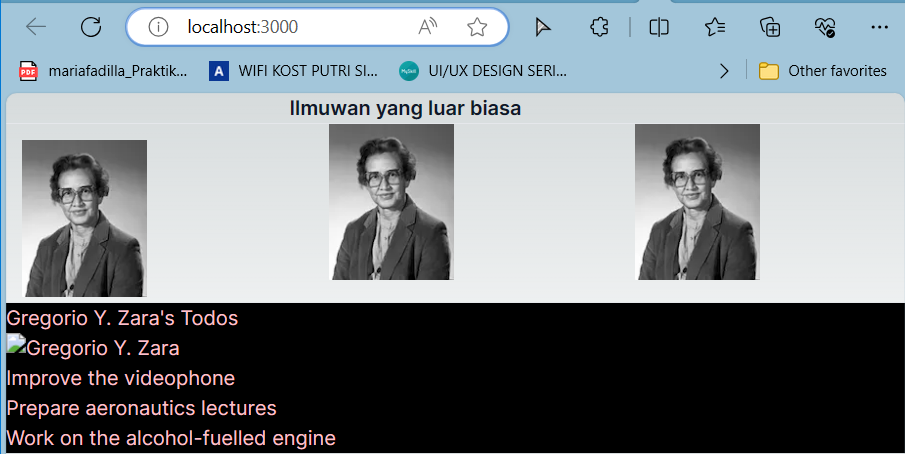


### **Jawaban Soal 6**

```bash
const baseUrl = 'https://i.imgur.com/';
const person = {
  name: 'Gregorio Y. Zara',
  imageId: '7vQD0fP',
  imageSize: 's',
  theme: {
    backgroundColor: 'black',
    color: 'pink'
  }
};

export default function TodoList() {
  return (
    <div style={person.theme}>
      <h1>{person.name}'s Todos</h1>
      
      <ul>
        <li>Improve the videophone</li>
        <li>Prepare aeronautics lectures</li>
        <li>Work on the alcohol-fuelled engine</li>
      </ul>
    </div>
  );
}
```


- Ketika menulis komponen React, jangan gunakan kurung kurawal ({}) untuk menggabungkan variabel di atribut src. Ini tidak berfungsi, karena kurung kurawal hanya berlaku di JSX, bukan di string. Jika kita melakukannya, variabel akan tetap sama, bukan berubah. Gunakan template literal ($ {}) untuk memasukkan ekspresi ke dalam string. Template literal adalah fitur JavaScript (ES6) yang memperjelas string. kita dapat membuat URL gambar yang sesuai dengan variabel kita. Ini juga memudahkan pembacaan dan pemeliharaan kode kita. Template literal membantu kita membuat komponen React yang bergerak dan terbaca.

- Mengubah nilai dari `imageSize` menjadi `'b'`

```bash
const baseUrl = 'https://i.imgur.com/';
const person = {
  name: 'Gregorio Y. Zara',
  imageId: '7vQD0fP',
  imageSize: 'b',
  theme: {
    backgroundColor: 'black',
    color: 'pink'
  }
};
```

Hasilnya adalah:

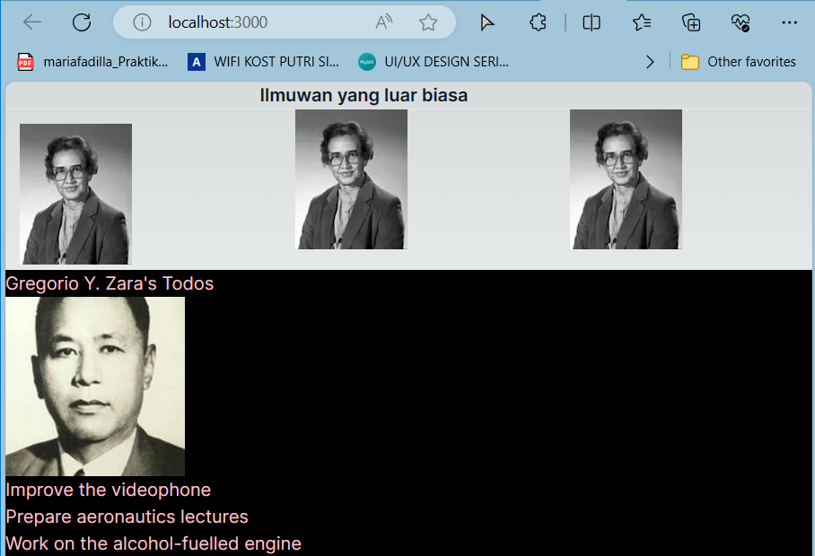

- Gambar bisa menyesuaikan ukuran setelah nilai dari `imageSize` diubah

## **Praktikum 04: Menggunakan Props**
---

**Membuat Komponen Baru**

Membuat file baru di `src/components/mygallery.tsx` berisi kode seperti berikut:

```bash
import { getImageUrl } from '@/utils/utils';

export default function MyGallery() {
  return (
    <div>
      <h1>Notable Scientists</h1>
      <section className="profile">
        <h2>Maria Skłodowska-Curie</h2>
        
        <ul>
          <li>
            <b>Profesi: </b> 
            Fisikawan dan kimiawan
          </li>
          <li>
            <b>Penghargaan: 4 </b> 
            (Penghargaan Nobel Fisika, Penghargaan Nobel Kimia, Medali Davy, Medali Matteucci)
          </li>
          <li>
            <b>Telah Menemukan: </b>
            polonium (unsur kimia)
          </li>
        </ul>
      </section>
      <section className="profile">
        <h2>Katsuko Saruhashi</h2>
        
        <ul>
          <li>
            <b>Profesi: </b> 
            Ahli Geokimia
          </li>
          <li>
            <b>Penghargaan: 2 </b> 
            (Penghargaan Miyake Geokimia, Penghargaan Tanaka)
          </li>
          <li>
            <b>Telah Menemukan: </b>
            sebuah metode untuk mengukur karbon dioksida pada air laut
          </li>
        </ul>
      </section>
    </div>
  );
}
```

`src/app/page.tsx`

```bash
import MyGallery from "@/components/mygallery";

export default function Home() {
  return (
    <section>
      <h1 className="font-semibold text-slate-900 truncate pr-20 text-center">Ilmuwan yang luar biasa</h1>
      <hr />
      <MyGallery />
    </section>
  );
}
```

Hasil tampilannya adalah:

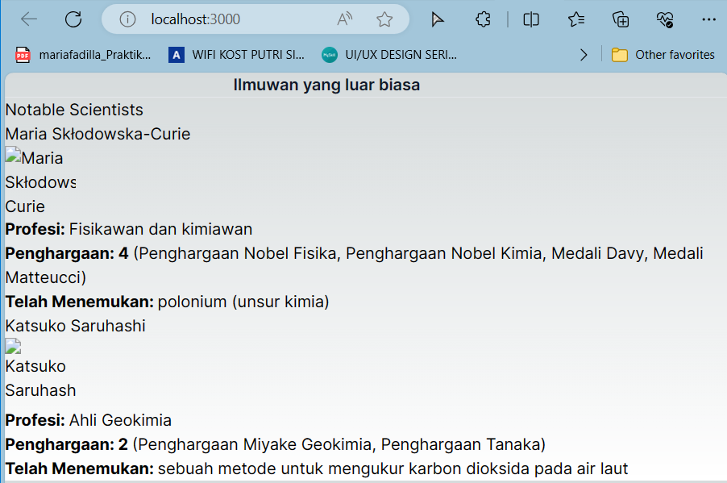

### **Jawaban Soal 7**

Jika kode di atas terdapat error, silakan diperbaiki. Komponen MyGallery ini berisi dua markup yang sama persis. Ekstraklah menjadi komponen MyProfile untuk mengurangi duplikasi. Anda perlu memilih props apa saja yang akan dikirimkan.

`src/components/mygallery.tsx`

```bash
import MyProfile from '@/components/myprofile';

export default function MyGallery() {
  return (
    <div>
      <h1>Notable Scientists</h1>
      <MyProfile
        name="Maria Skłodowska-Curie"
        imageUrl="szV5sdG"
        profession="Fisikawan dan kimiawan"
        awards={['Penghargaan Nobel Fisika', 'Penghargaan Nobel Kimia', 'Medali Davy', 'Medali Matteucci']}
        discovery="polonium (unsur kimia)"
      />
      <MyProfile
        name="Katsuko Saruhashi"
        imageUrl="YfeOqp2"
        profession="Ahli Geokimia"
        awards={['Penghargaan Miyake Geokimia', 'Penghargaan Tanaka']}
        discovery="sebuah metode untuk mengukur karbon dioksida pada air laut"
      />
    </div>
  );
}
```

`src/components/myprofile.tsx`

```bash
import { getImageUrl } from '@/utils/utils';

type ProfileProps = {
  name: string;
  imageUrl: string;
  profession: string;
  awards: string[];
  discovery: string;
};

export default function MyProfile({ name, imageUrl, profession, awards, discovery }: ProfileProps) {
  return (
    <section className="profile">
      <h2>{name}</h2>
      
      <ul>
        <li>
          <b>Profesi: </b> 
          {profession}
        </li>
        <li>
          <b>Penghargaan: {awards.length} </b> 
          ({awards.join(', ')})
        </li>
        <li>
          <b>Telah Menemukan: </b>
          {discovery}
        </li>
      </ul>
    </section>
  );
}
```

Hasil tampilannya adalah sebagai berikut:

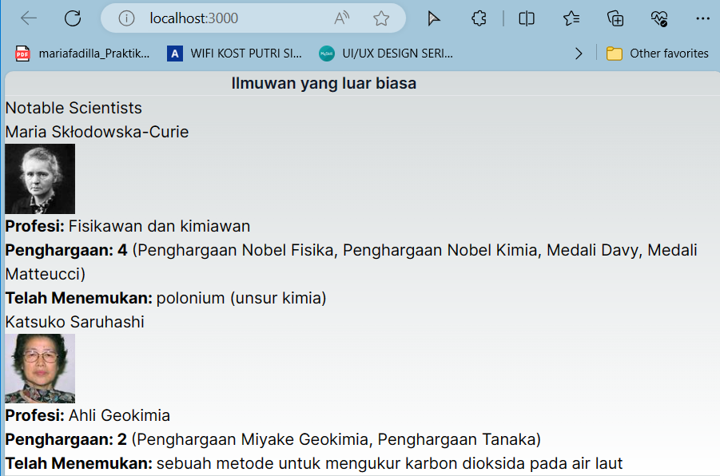

- Dalam praktikum ini, saya telah mempelajari tentang penggunaan props dalam React untuk mengirim data antara komponen. Penggunaan props memungkinkan kita untuk membuat komponen yang lebih fleksibel dan dapat digunakan kembali dengan mengirimkan data dinamis ke dalamnya.
- Dalam contoh yang diberikan, saya belajar tentang cara membuat komponen yang lebih terstruktur dan efisien dengan mengekstrak bagian-bagian tertentu dari markup menjadi komponen terpisah. Hal ini dapat dilakukan dengan membuat komponen yang menerima props sebagai input untuk menampilkan data secara dinamis.
- Tampilan saat ini, dengan menggunakan komponen MyProfile, kita dapat menampilkan setiap profil dengan memberikan data yang sesuai sebagai props ke komponen tersebut. Hasilnya adalah tampilan yang lebih terstruktur, mudah diperbaiki, dan mudah dimengerti.

Misalkan hanya ingin menampilkan satu profil: 

`src/components/mygallery.tsx`

```bash
import MyProfile from '@/components/myprofile';

export default function MyGallery() {
  return (
    <div>
      <h1>Notable Scientists</h1>
      <MyProfile
        name="Maria Skłodowska-Curie"
        imageUrl="szV5sdG"
        profession="Fisikawan dan kimiawan"
        awards={['Penghargaan Nobel Fisika', 'Penghargaan Nobel Kimia', 'Medali Davy', 'Medali Matteucci']}
        discovery="polonium (unsur kimia)"
      />
    </div>
  );
}
```

Tampilannya menjadi:

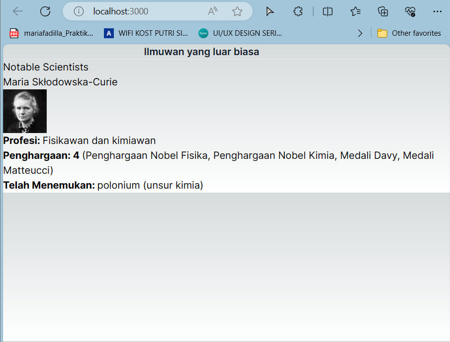

- Sejauh ini tampilannya masih sama dengan tampilan sebelum diekstrak menjadi komponen `MyProfile`.

### **Jawaban Soal 8**
### **Jawaban Soal 9**